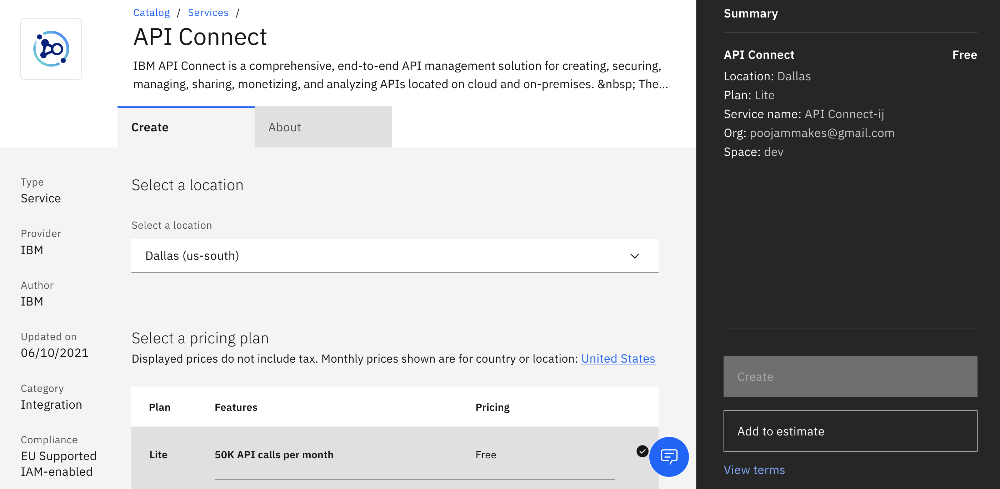
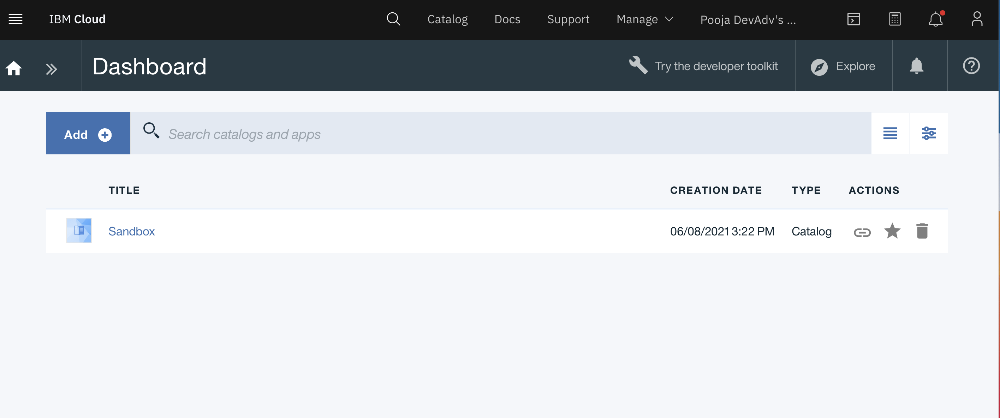
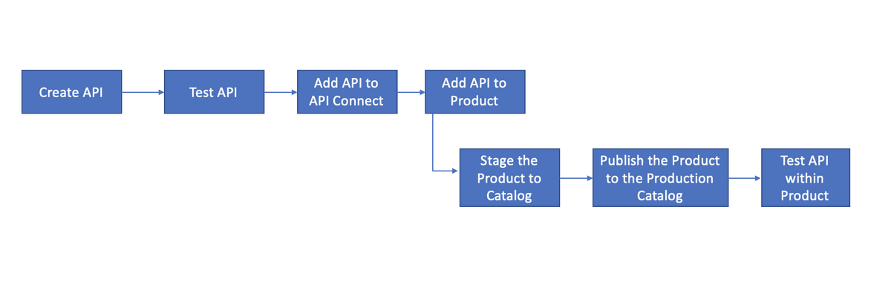

# Create, deploy and test a new API using API Connect 
[IBM® API Connect](https://www.ibm.com/cloud/api-connect)is a complete, intuitive and scalable API platform that lets developers create, expose, manage and monetize APIs across clouds.

In this lab you will create a new API using the OpenAPI definition of an existing RESTful web-service that gets realtime stock quotes. You will then test the API by deploying it in the Developer Portal. The app uses the API definition that you will create to get realtime stock quotes.

## Getting Started: 
In this workshop we will get you started with creating a Lite API Connect Service on IBM Cloud 

### Prerequisites
Register and create an [IBM Cloud Account](https://ibm.biz/ibm-tcs-workshop) 

### Setting up API Connect Service 

#### Step 1: 
Go to [IBM Cloud Catalog](https://cloud.ibm.com/catalog) and search for API Connect.

#### Step 2: 
Select `Lite` Plan and give your service a name. Click on the `Create` Button to create your Lite service

#### Step 3: 
Launch the service by clicking `Launch App Connect`

