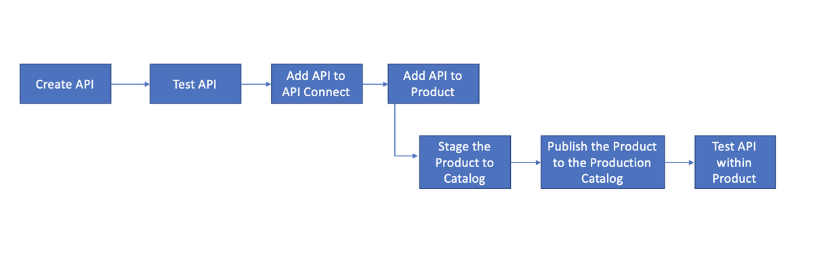
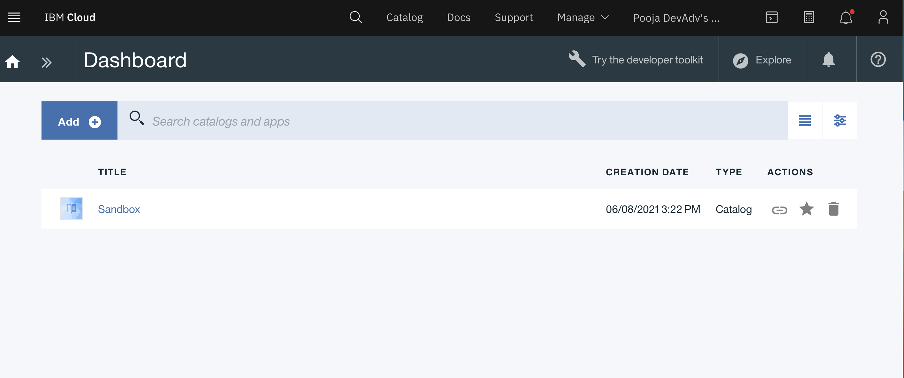
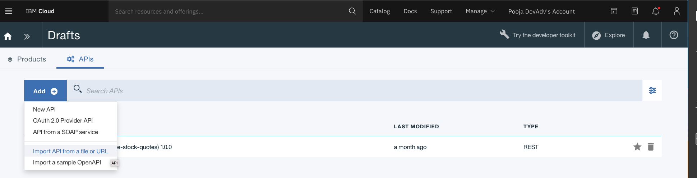
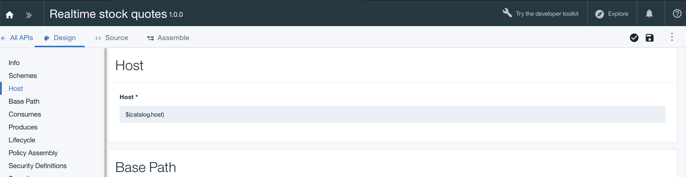
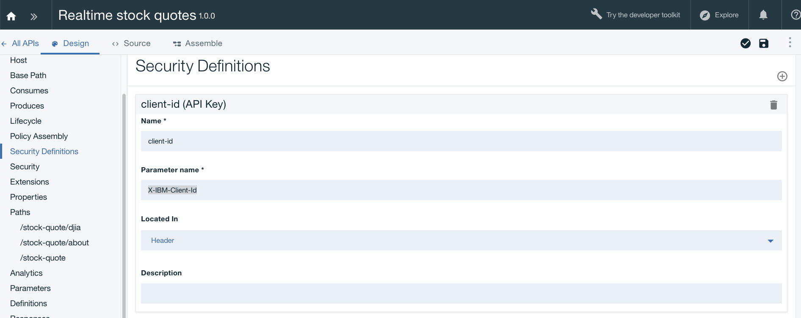
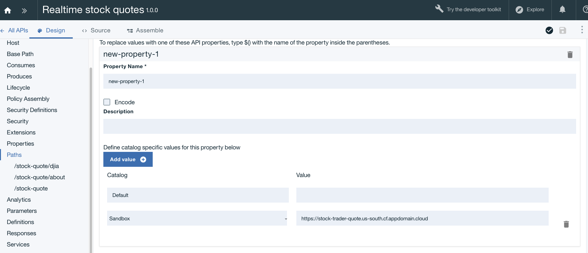

# Create, deploy and test a new API using the API Connect Developer Toolkit
In this [lab](https://github.com/IBM/api-connect-workshop/blob/main/lab.md) you will create a new API using the OpenAPI definition of an existing RESTful web-service that gets realtime stock quotes. You will then test the API by deploying it in the Developer Portal. The app uses the API definition that you will create to get realtime stock quotes.

The following diagram shows the workflow steps that needs to be completed before sharing the APIs.


After pushing the API to IBM Cloud, you can control usage, increase adoption and track statistics of APIs. 

Let’s get started.

## Prerequisites
- [Create IBM Cloud Account](https://github.com/IBM/api-connect-workshop#getting-started)
- [Create API Connect Service](https://github.com/IBM/api-connect-workshop#setting-up-api-connect-service)

## Steps 

#### 1. Go to API Conect Service
 On the IBM Cloud Dashboard, in the Cloud Foundry Services list, click the API Connect service instance. The API Connect dashboard is displayed.


#### 2. Add API in API Connect 
    - Click the Dashboard tab 
    - From the `>>` button next to the Home icon, click Drafts.
    - Click the APIs tab.
    - Select Add > Import API from file or URL



- Click on `Select File` and select [stock-quote-api.yaml](https://github.com/IBM/api-connect-workshop/blob/main/stock-quote-api.yaml) and `Import`

#### 3. Configure the API

After importing the existing API, the first step is to configure basic security before exposing it to other developers. By creating a client key you are able to identify the app using the services. Next, we will define the backend endpoints where the API is actually running. API Connect supports pointing to multiple backend endpoints to match your multiple build stage environments.

 *3.1* Scroll down the screen and replace the Host address with $(catalog.host) to indicate that you want calls to the external API to go through API Connect.



> Click Save 

*3.2*  In the Edit API screen click *Security Definitions* in the left navigation. 
- In the *Security Definition* section, click the *Add* button on the right and select `API Key`. This will open a new view titled `api-key-1 (API Key)`.

- In the Name field, type `client-id`
- Ensure Parameter name is `X-IBM-Client-Id`
- Located In `Header`
- Click Save



*3.3* Click on *Security* on the left nav and add `client-id(API-KEY)`


> Save

*3.4* Next you'll define the endpoint for the external API. Click on Properties in the left menu.

- Add New Property, should be called `new-property-1`
- Choose the sandbox catalog from the drop down and for the URL copy and paste the following URL:

```https://stock-trader-quote.us-south.cf.appdomain.cloud```


> Save

#### 4 Test the API 

